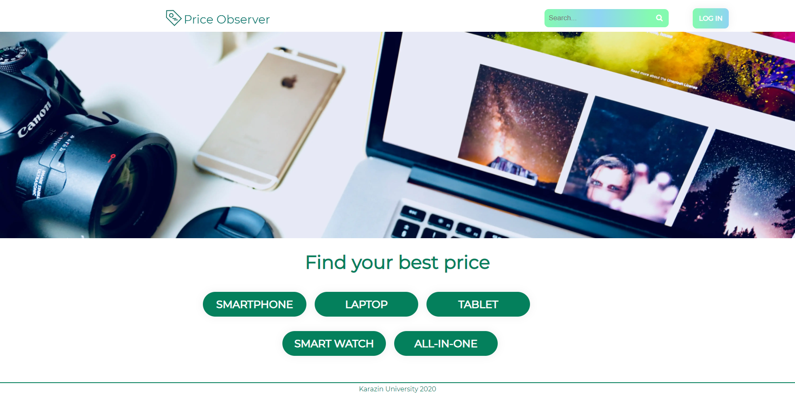
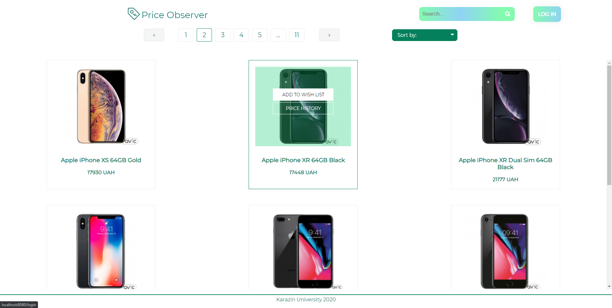
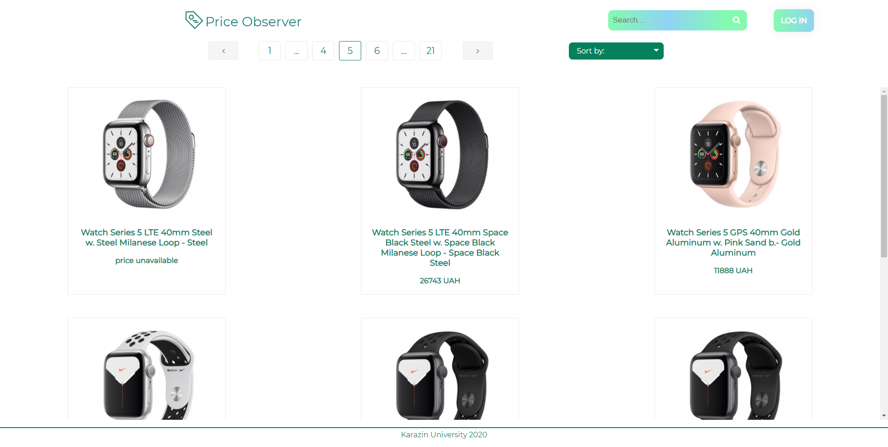
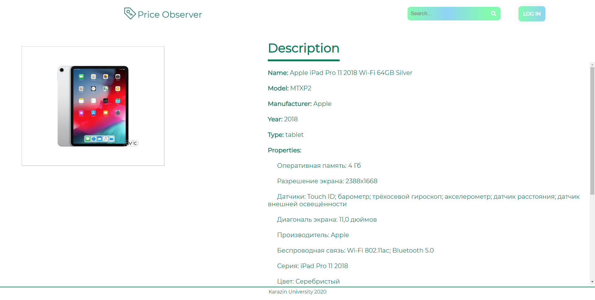
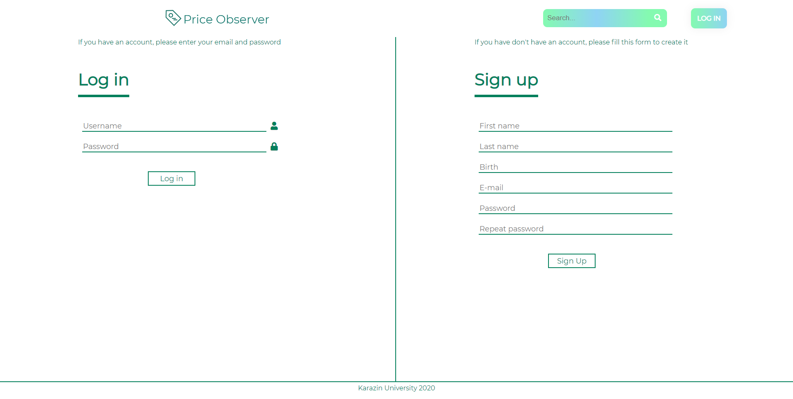
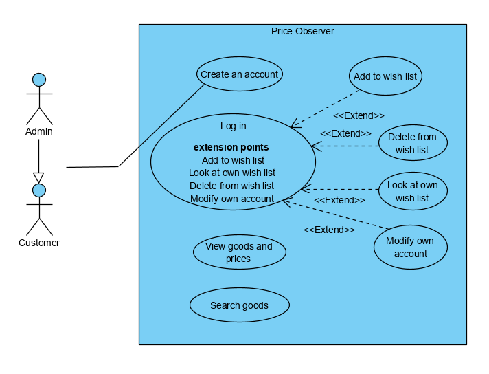
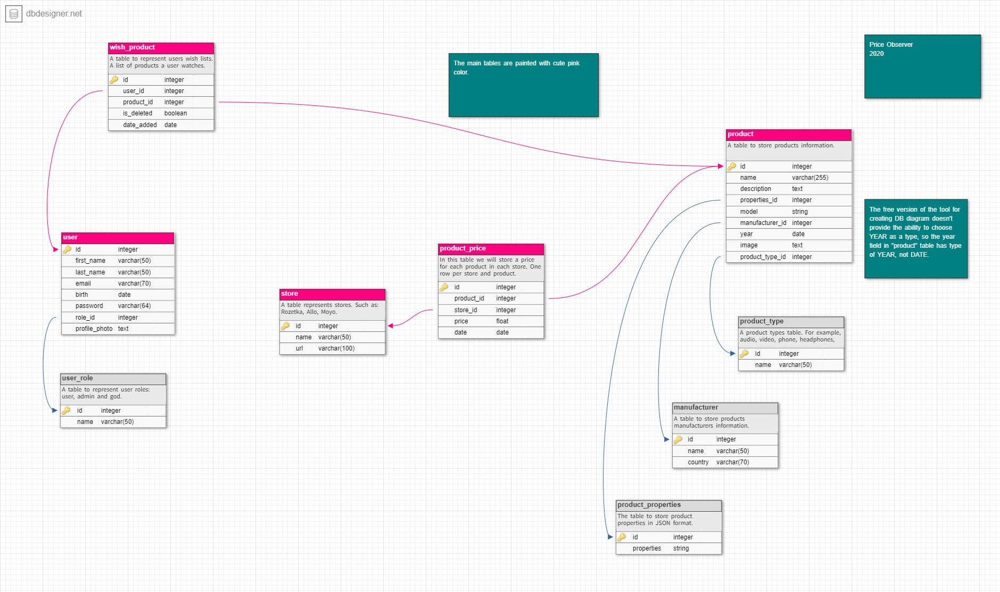

# Price Observer

## Introduction

The application itself is a pretty and clear tool to monitor the price of popular products. In the current version the
application support only the products made by Apple company.  
Price Observer supports Sign-In/Sign-Up possibility implemented with Spring Security. Authorized users can add products
they like into the wishlist for more comfortable price monitoring. The full list of the application features you may see
below:

- Review existing product categories;
- Search product by name or model;
- Review a product description and its price history;
- Create an account in the application;
- Sign In using your account and add products to the wishlist;
- Change account information.

Price Observer has a very smooth and useful User Interface. The main page of the application looks in a next way:

You may see five main product categories on the main page. When you click on any of them you will be redirected to this
category page. Here is the "Smartphone" category page.

The same page for the "Smartwatch" category.

When you click on the product you like, the page with a detailed product description is opened.

Also, I need to show you how nice our Sign-in/Sign-Up page looks like.

## Documentation

### Use case diagram

### Project structure

The project represents Maven multi-module project. It has four main modules:

- [auto](auto) module, which contains auto-tests;
- [core](core) module, which contains business logic and logic to interact with a database;
- [parser](parser) module, which contains logic to parse store sites;
- [webapp](webapp) module, which contains web-application layer logic (controllers, etc).

### Database structure

The application uses MySQL database. For the database creation is used [main.sql](db/main.sql) file. Other important
database scripts may be found in this [folder](db). 
The database schema visualization is provided below:

#### Database filling

To fill the database with product information the application uses store sites parsing. To parse sites was used Java
library **[jsoup](https://jsoup.org/)**

## Authors

🦉 **Viktoriia Abakumova**

- Email: abakumovaviktory@gmail.com
- [LinkedIn](http://linkedin.com/in/viktoriia-abakumova)

🦝 **Evgeniy Kiprenko**

- Email: zhenyakiprenko@gmail.com
- [LinkedIn](https://www.linkedin.com/in/kiprenko/)